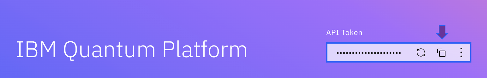
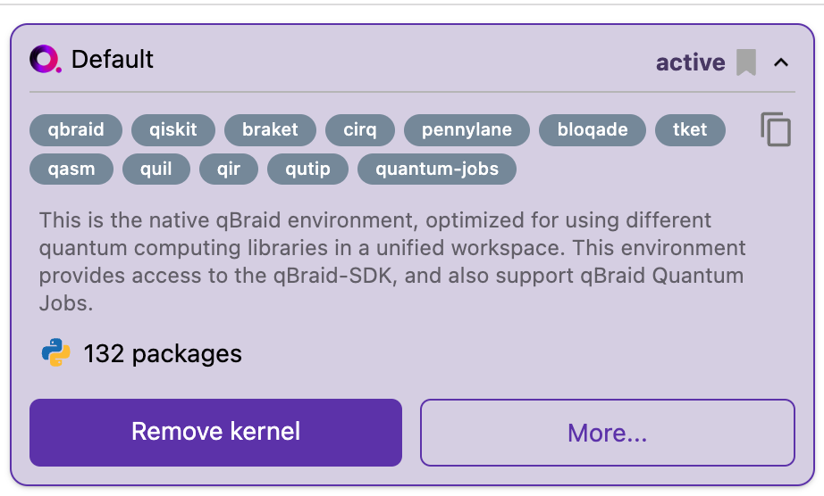

# Welcome to MIT iQuHACK 2024 - IBM Challenge!!

> [!IMPORTANT]
**IBM Challenge is only for in-person attendees**

- [Overview](#overview)
- [Final Teams](#final-teams)
- [Winners](#-winners-)
------

Preparation

- [Requirement](#requirement)
  - [Access to IBM Hardware](#access-to-ibm-hardware)
  - [Working on qBraid Lab](#working-on-qbraid-lab)
  - [Working on IBM Quantum Lab](#working-on-ibm-quantum-lab)
  - [Working on Locally](#working-on-locally)
- [Submitting the tasks](#submitting-the-tasks)
- [Judging Criteria](#judging-criteria)
- [Winners and Awards](#winners-and-awards)
- [Resources](#resources)
  - [Learning Materials](#learning-materials)
    - [Quantum Computing and Algorithms](#quantum-computing-and-algorithms)
    - [Workflow Example Tutorials](#workflow-example-tutorials)
  - [API Reference](#api-reference)
  - [Useful Resources](#useful-resources)
- [Tips](#tips)
- [Feedbacks and Discussions](#feedbacks-and-discussions)

## **Overview**

We've entered a new era of quantum computing - The Quantum Utility era.

Quantum utility is what we get when a quantum computer can perform reliable computations at a scale beyond brute force classical computing methods that provide exact solutions to computational problems.

Now, computational scientists and other researchers can tackle these large-scale problems using quantum computers with IBM's 100+ qubits backends accessible to everybody. That's an enormous milestone in the field's history because, until recently, all quantum computers were small, experimental devices primarily used to advance the study of quantum computing. Entering the era of quantum utility is, in other words, the quantum computers we have today are valuable tools researchers can use to explore meaningful scientific problems. Now it is your turn to tackle and explore issues with this leading-edge computational resource.

This challenge aims to design and build a cloud-based, quantum-powered application that addresses a real-world problem and is accessible to end users. This includes applications of quantum algorithms that can have practical usage and, in theory, be exposed to businesses or individual users on the internet for consumption. Teams should identify a problem that can be solved (not necessarily more efficiently) with quantum computers.

We encourage contestants to be creative and to leverage their existing quantum knowledge to develop new applications and experiments. To get you started, we offer some suggestions and prompts that may lead to interesting projects.

Beginner
- An implementation of [Quantum Key Distribution](https://en.wikipedia.org/wiki/BB84)
- An application involving the [Quantum Approximate Optimization Algorithm (QAOA)](https://learning.quantum.ibm.com/tutorial/quantum-approximate-optimization-algorithm)
- A simulation probing the [dynamics](https://docs.quantum.ibm.com/api/qiskit/qiskit.synthesis.SuzukiTrotter) of a [chemical](https://www.youtube.com/watch?v=DWOfMWPKHDU)

Intermediate
- A realization of [Quantum Signal Processing (QSP)](https://github.com/ichuang/pyqsp)
- An implementation of [amplitude estimation](https://arxiv.org/abs/1912.05559)

Advanced
- A realization of [port-based quantum teleportation](https://arxiv.org/abs/0807.4568)
- An experiment involving [holographic quantum states](https://arxiv.org/abs/2110.14691)

Open-Ended
- A cryprographically secure quantum random number generator
- A quantum game illustrating the weirdness of quantum mechanics
- A quantum calculator using reversible arithmetic

> [!NOTE]
The idea is that it serves a practical use case and can be accessed by anyone without special tooling that is not already included in a typical computer installation (or minimal installation)

## Final Teams
Thank you for choosing IBM Quantum Challenge!

- hyperposition: [Repository](https://github.com/GeorgeHolm/ALQORITHM)
- Bulldogs: [Repository](https://github.com/shannenespinosa/iquhack24)
- Stockfish: [Repository](https://github.com/aace217/iQuHACK2024)
- team-7: [Repository](https://github.com/grid-rider/team-7-iQuHACK)
- mass2024: [Repository](https://github.com/quargsgreene/ibmgamechallenge)
- [B]Alde's Gate: [Repository](https://github.com/coderalde/iQuHack-2024-B-Alde-s-Gate/tree/main)

## 🏆 Winners 🏆

Congratulations to all winners!

<h2> 🥇 1st Place </h2>

**Team Bulldogs**: "Organ Donation QuAllocation
Quantum Approximate Optimization Algorithm for Organ Donor and Patient Matching" 
- https://github.com/shannenespinosa/iquhack24
- Members:
  - [Shannen Espinosa](https://www.linkedin.com/in/shannenespinosa/)
  - [Siona Tagare](https://www.linkedin.com/in/siona-tagare-2aa71a2a6/)
  - [Alma Alex](http://www.linkedin.com/in/alma-alex-b41596236)
  - [Annli Zhu](https://www.linkedin.com/in/annli-zhu-214016184/)

<h2>🥈 2nd Place </h2>

**Team team-7**: "MITqute" 
- https://github.com/grid-rider/team-7-iQuHACK
- Members:
  - [Liam Kronman](https://www.linkedin.com/in/liam-kronman/)
  - [Maggie Bao](@maggie-bao202)
  - [Nicole Shen](https://github.com/nic0les)
  - [Armin Ulrich](https://www.linkedin.com/in/arminulrich/)
  - [Sierra Romo](https://www.linkedin.com/in/sierra-romo-568002253/)

<h2>🥉 3rd Place </h2>

**Team hyperposition**: "ALQORITHM: A novel, quantum signal processing-based algorithm builder"
- https://github.com/GeorgeHolm/ALQORITHM
- Members:
  - [Brennan Lagasse](https://github.com/BrennanLagasse)
  - [Frank Wong](https://github.com/frank-cywong)
  - [Pranet Sharma](https://github.com/pranetksharma)
  - [George Holm](https://github.com/GeorgeHolm)
  - [Diya Naik](https://github.com/diyamagnetism)
---

## **Requirement**

### Access to IBM Hardware
In order to gain access to IBM Quantum hardware for working on qBraid Lab or Locally:

1. Login to https://quantum.ibm.com/. If you don't have your IBMid, please signin first. 
2. After login, please copy your "API Token" by clicking double square butten at the top right and save it for the aBraid Quantum Lab

### Working on qBraid Lab

1. If you're working on qBraid, first fork this repository and click the above `Launch on qBraid` button. It will take you to your qBraid Lab with the repository cloned.
   
2. Use the default environment to use the latest Qiskit.

3. [This tutorial](https://github.com/qBraid/qbraid-lab-demo/blob/main/qbraid_sdk/ibm_quantum_jobs_with_runtime.ipynb) will give you a guideline on how to use your own IBM Quantum Credential. You can find it through qBraid Lab under the "qbraid_sdk" folder as well. 

### Working on IBM Quantum Lab

You can also work on the [IBM Quantum Platform](https://quantum.ibm.com/), by using [IBM Quantum Lab](https://quantum.ibm.com/lab). In Quantum Lab, you can write scripts that combine Qiskit code, equations, visualizations, and narrative text in a customized Jupyter Notebook environment — no installation required. Run code on real quantum hardware(opens in a new tab) or simulators(opens in a new tab). Store, access, and manage your files from anywhere.

> [!IMPORTANT]
While you are using IBM Quantum Lab, you don't need to select a channel or save tokens.

### Working on Locally
If you will work locally or in a cloud environment, all users' first step is installing Qiskit. 

Please follow [this installation tutorial](https://docs.quantum.ibm.com/start/install). After installing the latest Qiskit, You can access IBM Quantum systems by using the `IBM Quantum Platform` or `IBM Cloud` channel. Channel is the term used to describe the method you use to access IBM Quantum services, and for this challenge, we suggest you use the `IBM Quantum Platform` channel and follow this [instruction](https://docs.quantum.ibm.com/start/setup-channel#set-up-to-use-ibm-quantum-platform) to set up a channel for your project.

## Submitting the tasks

> [!IMPORTANT]
Submission Due: 10am ET, 4th Feb (Sunday) 
Link will expires after due.

Submission: Thank you so much for choosing IBM Quantum Challenge!

## **Judging Criteria**

1. **Technical Aspects (30%)** : This category includes the following subcategories:
    - Quantum Complexity : How complex is the quantum algorithm? How optimized is it?
    - Architecture : Does the architecture leverage cloud technologies to optimize cost? Can the architecture serve users at a reasonable scale?
    - Accessibility/User Experience : How accessible is the end user application? Is it easy to use and intuitive for end users?
2. **Originality and Uniqueness (25%)** : How unique is this project compared to others? How interesting is it? Did the team attempt something new or difficult?
3. **Usefulness and Complexity (25%)** : How useful is the project and how well-designed is it? How functional is it at the time of judging? Can it be used in real-world business applications or serve as a valuable tool for individuals?
4. **Presentation (20%)** : How well did the team present their project? Were they able to explain their decisions? Did the entire team have a chance to speak?

## Winners and Awards

Winners: TBA

- Winners will receive a digital certificate and can get a [Tier 1](https://github.com/qiskit-advocate/application-guide) score when they apply for the Qiskit Advocate. 
- The number of total winners might depend on the number of applications.

## Resources

### Learning Materials

#### Quantum Computing and Algorithms

- [Basics of quantum information](https://learning.quantum.ibm.com/course/basics-of-quantum-information) by John Watrous (Award Badge Available)
- [Fundamentals of quantum algorithms](https://learning.quantum.ibm.com/course/fundamentals-of-quantum-algorithms) by John Watrous
- [Variational algorithm design](https://learning.quantum.ibm.com/course/variational-algorithm-design)

#### Workflow Example Tutorials

- [Qiskit Runtime Lab](https://github.com/JavaFXpert/qiskit-runtime-lab) by [James Weaver](https://github.com/JavaFXpert)
- [Variational quantum eigensolver](https://learning.quantum.ibm.com/tutorial/variational-quantum-eigensolver)
- [Quantum approximate optimization algorithm](https://learning.quantum.ibm.com/tutorial/quantum-approximate-optimization-algorithm)
- [CHSH inequality](https://learning.quantum.ibm.com/tutorial/chsh-inequality)
- [Max-Cut](https://learning.quantum.ibm.com/tutorial/max-cut)
- [Heisenberg chain](https://learning.quantum.ibm.com/tutorial/heisenberg-chain)
- [And More!](https://learning.quantum.ibm.com/catalog/tutorials)

### API Reference

- [Qiskit](https://docs.quantum.ibm.com/api/qiskit)
- [Qiskit Runtime IBM Client](https://docs.quantum.ibm.com/api/qiskit-ibm-runtime)
- [Qiskit IBM Runtime REST API](https://docs.quantum.ibm.com/api/runtime/tags/jobs)
- [Qiskit IBM Provider](https://docs.quantum.ibm.com/api/qiskit-ibm-provider)

### Useful Resources

- [Qiskit Youtubes](https://www.youtube.com/Qiskit)
- [IBM Quantum Blogs](https://www.ibm.com/quantum/blog)
- [Qiskit Slack](https://qisk.it/join-slack): Meet the community!

## Tips
This year’s iQuHACK challenges require a write-up/documentation portion that is heavily considered during
judging. The write-up is a chance for you to be creative in describing your approach and describing
your process. It can be in the form of a blog post, a short YouTube video or any form of
social media. It should clearly explain the problem, the approach you used, your implementation with results
from simulation and hardware, and how you accessed the quantum hardware (total number of shots used, 
backends used, etc.).

Make sure to clearly link the documentation into the `README.md` and to include a link to the original challenge 
repository from the documentation.

## Feedbacks and Discussions

Your opinions matter! Place to share your feedback on Qiskit [here](https://github.com/Qiskit/feedback
); stay up to date with release planning and DemoDays; and find out where to get support.
